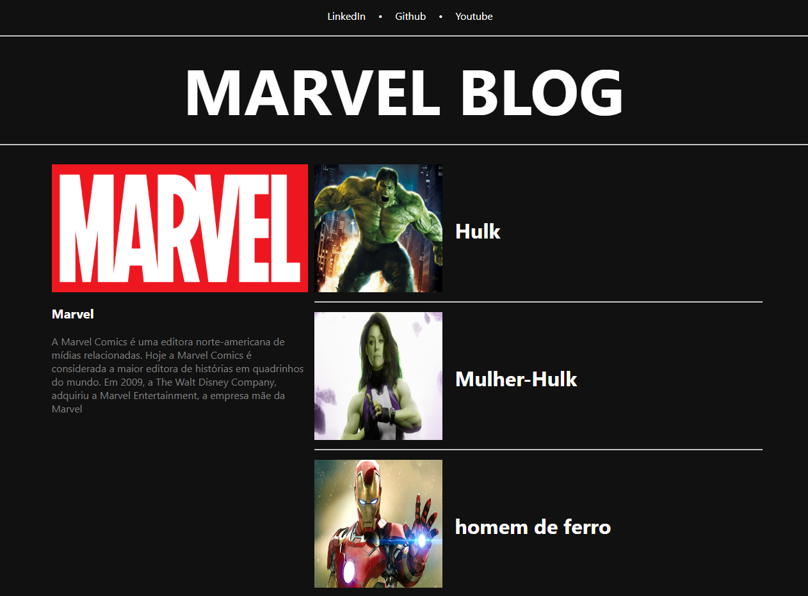
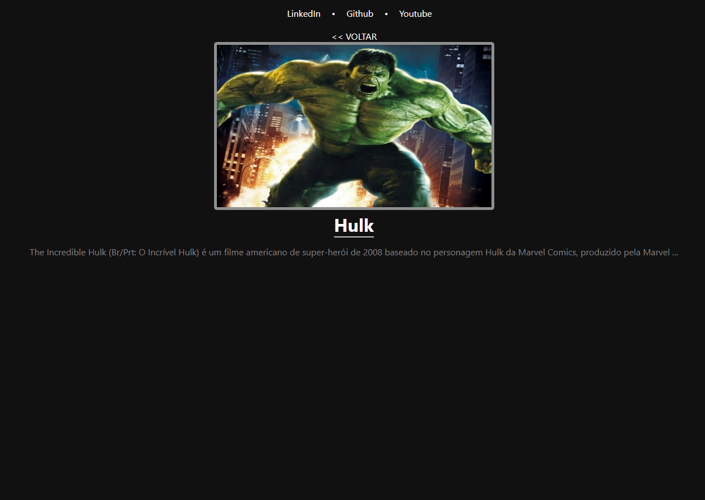

# AngularBlog

---

## Indice

- [AngularBlog](#AngularBlog)
  - [Indice](#indice)
  - [Sobre](#sobre)
  - [Funcionalidade da Aplicação](#funcionalidade-da-aplicação)
  - [Tecnologias utilizadas](#tecnologias-utilizadas)
  - [Como baixar o projeto](#como-baixar-o-projeto)
  - [Telas](#telas)
  - [Autor](#autor)
  
---

## Sobre

O Projeto **AngularBlog** foi desenvolvido para estudo para criar um blog simples que segue o curso formação Angular Develop da plataforma DIO (https://www.dio.me/).

---

## Funcionalidade da Aplicação

As funcionalidades são:
- Listar Filmes;
- Visualizar Filme por id;

---
## Tecnologias utilizadas 

O projeto foi desenvolvido utilizando as seguintes tecnologias
- Angular 13
- TypeScript
- CSS
- HTML

---

## Como baixar o projeto

```bash
# Clonar o repositório em sua máquina 
$ git clone https://github.com/francelinom/angular-blog.git

# Entrar na pasta do projeto 
$ cd angular-blog

# Instalar todas as dependências 
$ npm i

# Iniciar o projeto 
ng serve
# or
yarn dev

Abrir o projeto na porta: http://localhost:4200
```

---
## Telas




---
## Autor

Desenvolvido por **Francelino Marcílio da Silva** 
<h1>
  
</h1>
